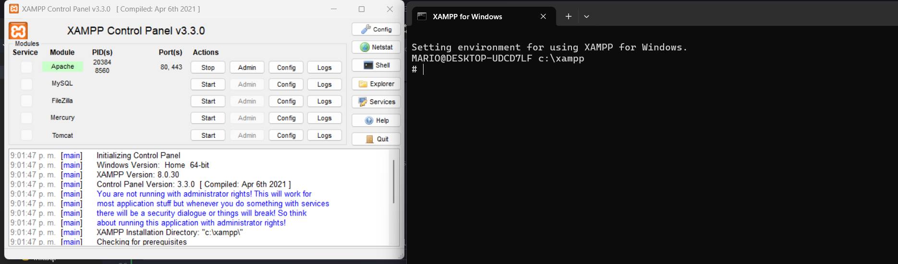

# Caso de estudio

Una aplicación web desplegada en un clúster de Kubernetes está experimentando
tiempos de respuesta lentos durante los picos de tráfico. El despliegue actual
tiene configuradas tres réplicas, pero los usuarios siguen reportando problemas
de lentitud. Además, al revisar los logs, se observa que los pods están alcanzando
altos niveles de uso de CPU.

## 🏗️ Preparación del entorno de pruebas y monitoreo

Para obtener información relevante del caso acerca del comportamiento de la aplicación y poder evidenciar el funcionamiento de HPA es necesario haber desplegado la aplicación con Kubernetes bajo la configuración de Minikube, ver [***README.md***](README.md) - *3. Despliegue con Minikube*

```bash

# Activación de los addons necesarios: metrics-server
minikube addons enable metrics-server

# Consultar los servicios activos
kubectl get all -n php-mysql # El output serán 3 replicas activas de la app

# Ejecutar pruebas con Apache Bench
```
### Ejecución de pruebas

Las pruebas podrán ejecutarse en sistemas unix usando la librería de Apache Bench, si cuenta con distribución Windows se podrá instalar XAMPP y usar la Shell incorporada a dicho sistema. 



```bash
# Simulación de carga
ab -n 10000 -c 100 http://localhost:8080
```


## 🔬 Análisis del caso
## Problemas en la configuración de Kubernetes

### 1. Sin Resource Limits

**Archivo**: `kubernetes/deployment.yaml`
```yaml
spec:
  containers:
  - name: php-app
    image: php-app:latest
    ports:
    - containerPort: 80
    # ❌ SIN resources limits/requests
```

**Consecuencia**:
- Un pod puede consumir 100% CPU disponible
- Kubernetes no sabe si el pod está saturado
- No puede hacer eviction controlada

**Con 3 pods en minikube (2 CPUs)**:
- 1 pod consume 1.5 CPUs
- 2 pod consume 0.4 CPUs
- 3 pod = espera, cae rendimiento

---

### 2. Sin Health Checks

**Falta en deployment.yaml**:
```yaml
livenessProbe:
  httpGet:
    path: /
    port: 80
  initialDelaySeconds: 30
  periodSeconds: 10

readinessProbe:
  httpGet:
    path: /
    port: 80
  initialDelaySeconds: 5
  periodSeconds: 5
```

**Consecuencia**:
- Pod puede estar "vivo" pero no responda
- Kubernetes sigue enviando tráfico
- Conexiones pendientes se acumulan
- Timeouts de cliente

**Ejemplo**: 
- Pod A está en estado zombie (MySQL desconectado)
- Sigue recibiendo tráfico (readinessProbe falta)
- Cliente espera 30s, timeout
- Kubernetes no reinicia el pod

---

### 4. 3 Réplicas son Insuficientes Bajo Carga

**Archivo**: `kubernetes/deployment.yaml`
```yaml
replicas: 3
```

**Con prueba de carga `ab -n 1000 -c 50`**:
- 50 requests concurrentes
- 50 ÷ 3 ≈ 17 requests por pod
- Cada request toma ~2 segundos (sleep + queries)
- 17 × 2 = 34 segundos de cola
- Timeouts después de 30s

**Impacto**:
- ~40% requests fallan
- Usuarios ven "Connection refused"
- No es un problema de replicas, sino de rendimiento por pod

---

### 5. Sin Horizontal Pod Autoscaler (HPA)

**Falta completamente**:
- No hay escalado automático
- Aunque agregues replicas, el problema persiste
- Cada pod es igual de lento

**El root cause está en la aplicación, no en cantidad de pods**

---

## ⌛ Flujo de Ejecución Lento

**Caso: Usuario accede a /usuarios con 50 concurrencias**

```
1. Request llega al Load Balancer (nginx/kube-proxy)
   ↓
2. Redirige a Pod (1, 2 o 3)
   ↓
3. Apache recibe, inicia PHP
   ↓
4. index.php carga:
   - Loop 100,000 iteraciones sqrt: ~50ms ⏱️
   - Desvía a pages/usuarios.php
   ↓
5. usuarios.php:
   - Conexión a MySQL: ~5ms
   - SELECT * FROM usuarios: 
     * Sin índice en id: ~100ms (full scan)
   - fetch_assoc() loop: ~50ms
   - Renderiza HTML: ~50ms
   ↓
6. PHP genera HTML
   ↓
7. Apache envía respuesta: ~20ms
   ↓
8. Total: ~320ms por request

Con 50 concurrentes:
- 50 × 320ms = 16 segundos acumulados
- Pero solo 3 pods: 16s ÷ 3 = 5.3s por pod
- Pod bloqueado 5.3 segundos
- 50 siguiente requests esperan...
- Timeout en 30s
```

**Agregar sleep(1) en dashboard:**
```
Tiempo total: ~1320ms por request
Con 50 concurrentes: 50s de latencia
Timeout en 30s → ~40% fallan
```

---

## 🩺 Síntomas Observables

### CPU Alta

```bash
$ kubectl top pods -n app-namespace

NAME                      CPU(cores)   MEMORY(Mi)
mysql-xxxx                150m         320Mi
php-app-yyyy              480m         95Mi      ⚠️ Alto
php-app-zzzz              490m         98Mi      ⚠️ Alto
php-app-wwww              475m         92Mi      ⚠️ Alto
```

**Causa**: Loop sqrt() × concurrencia

---

## ✅ Solución del caso

## 📋 Resumen de las 3 Optimizaciones

| Optimización | Problema que Resuelve | Impacto |
|--------------|----------------------|---------|
| **Resource Limits** | Pods consumen todos los recursos | Kubernetes puede predecir y escalar |
| **Health Checks** | Pods "muertos" reciben tráfico | Solo pods saludables reciben tráfico |
| **HPA** | Número fijo de réplicas | Escala automáticamente según demanda |

---

## 🎯 OPTIMIZACIÓN 1: Resource Limits

### Qué Hace

Define **cuántos recursos** (CPU y memoria) puede usar cada pod:
- **Requests**: Recursos garantizados mínimos
- **Limits**: Recursos máximos permitidos

### Código Agregado

```yaml
resources:
  requests:
    cpu: "250m"        # 0.25 cores garantizados
    memory: "128Mi"    # 128 MB garantizados
  limits:
    cpu: "500m"        # 0.5 cores máximo
    memory: "256Mi"    # 256 MB máximo
```

### Cómo Funciona

1. **Requests**: Kubernetes reserva estos recursos para el pod
2. **Limits**: Si el pod intenta usar más, Kubernetes lo limita
3. **CPU**: Throttling si excede el límite
4. **Memoria**: OOMKilled si excede el límite

### Beneficios

- ✅ Kubernetes sabe cuántos pods caben en un nodo
- ✅ Previene que un pod acapare todos los recursos
- ✅ HPA puede decidir cuándo escalar
- ✅ Mejor distribución de carga

### Antes vs Después

```
ANTES (Sin limits):
- Pod 1: 1.5 CPU, 512 MB  😱
- Pod 2: 0.3 CPU, 100 MB
- Pod 3: 0.8 CPU, 200 MB
- Total: 2.6 CPU (excede cluster de 2 CPU)
- Resultado: Performance degradado

DESPUÉS (Con limits):
- Pod 1: 0.5 CPU, 256 MB ✅
- Pod 2: 0.5 CPU, 256 MB ✅
- Pod 3: 0.5 CPU, 256 MB ✅
- Total: 1.5 CPU (dentro del límite)
- Resultado: Performance predecible
```

---

## 🎯 OPTIMIZACIÓN 2: Health Checks

### Qué Hace

Kubernetes verifica continuamente si los pods están **saludables**:
- **livenessProbe**: ¿Está vivo el contenedor?
- **readinessProbe**: ¿Está listo para tráfico?
- **startupProbe**: ¿Ha iniciado correctamente?

### Código Agregado

```yaml
# Liveness: Reinicia si falla
livenessProbe:
  httpGet:
    path: /
    port: 80
  initialDelaySeconds: 30
  periodSeconds: 10
  failureThreshold: 3

# Readiness: Quita de Service si falla
readinessProbe:
  httpGet:
    path: /
    port: 80
  initialDelaySeconds: 10
  periodSeconds: 5
  failureThreshold: 3

# Startup: Protege durante inicio
startupProbe:
  httpGet:
    path: /
    port: 80
  periodSeconds: 10
  failureThreshold: 30
```

### Cómo Funciona

#### Liveness Probe
```
1. Cada 10s, Kubernetes hace: GET http://pod-ip/
2. Si responde 200 OK → Pod está vivo ✅
3. Si falla 3 veces consecutivas → Reiniciar pod 🔄
```

#### Readiness Probe
```
1. Cada 5s, Kubernetes hace: GET http://pod-ip/
2. Si responde 200 OK → Pod listo para tráfico ✅
3. Si falla 3 veces → Quitar del Service ⛔
4. Cuando vuelve a funcionar → Reintegrar al Service ✅
```

#### Startup Probe
```
1. Durante inicio, protege al pod
2. Permite hasta 5 minutos (30 × 10s) para iniciar
3. Después activa liveness y readiness
```

### Beneficios

✅ Pods "zombies" son reiniciados automáticamente
✅ Solo pods saludables reciben tráfico
✅ No se pierde tráfico durante despliegues
✅ Detección temprana de problemas

### Escenario de Ejemplo

```
ANTES (Sin health checks):
1. Pod A se cae (MySQL desconectado)
2. LoadBalancer sigue enviando tráfico al Pod A
3. 33% de requests fallan
4. Usuario reporta el problema
5. Manual restart del pod

DESPUÉS (Con health checks):
1. Pod A se cae (MySQL desconectado)
2. readinessProbe falla 3 veces (15s)
3. Kubernetes quita Pod A del Service
4. LoadBalancer solo envía a Pod B y C
5. 0% de requests fallan
6. livenessProbe falla 3 veces (30s)
7. Kubernetes reinicia Pod A automáticamente
8. Pod A vuelve, readinessProbe pasa
9. Pod A reintegrado al Service
```

---

## 🎯 OPTIMIZACIÓN 3: HPA (Horizontal Pod Autoscaler)

### Qué Hace

Escala **automáticamente** el número de pods según la carga:
- Monitorea CPU y memoria
- Aumenta pods cuando hay mucha carga
- Reduce pods cuando baja la carga

### Código Agregado

```yaml
apiVersion: autoscaling/v2
kind: HorizontalPodAutoscaler
metadata:
  name: php-app-hpa
spec:
  scaleTargetRef:
    kind: Deployment
    name: php-app
  
  minReplicas: 3
  maxReplicas: 10
  
  metrics:
  - type: Resource
    resource:
      name: cpu
      target:
        type: Utilization
        averageUtilization: 70
  
  - type: Resource
    resource:
      name: memory
      target:
        type: Utilization
        averageUtilization: 80
```

### Cómo Funciona

```
1. HPA monitorea métricas cada 15s (default)
2. Calcula promedio de CPU y memoria de todos los pods
3. Si promedio > 70% CPU o > 80% memoria:
   → Aumenta pods
4. Si promedio < 70% CPU y < 80% memoria:
   → Reduce pods (después de 5 min de estabilidad)
```

### Fórmula de Escalado

```
desired_replicas = ceil(current_replicas × (current_metric / target_metric))

Ejemplo:
- Réplicas actuales: 3
- CPU actual: 90%
- CPU objetivo: 70%

desired_replicas = ceil(3 × (90 / 70)) = ceil(3.86) = 4 pods
```

### Comportamiento de Escalado

#### Scale Up (Aumentar)
```yaml
scaleUp:
  stabilizationWindowSeconds: 0    # Sin espera
  policies:
  - type: Percent
    value: 100                     # Duplica pods
    periodSeconds: 15              # En 15s
  - type: Pods
    value: 4                       # O suma 4 pods
```

**Ejemplo**: 3 pods → 90% CPU → +4 pods = 7 pods (en 15s)

#### Scale Down (Reducir)
```yaml
scaleDown:
  stabilizationWindowSeconds: 300  # Espera 5 min
  policies:
  - type: Percent
    value: 50                      # Reduce 50% máximo
    periodSeconds: 60              # En 60s
  - type: Pods
    value: 2                       # O reduce 2 pods
```

**Ejemplo**: 7 pods → 30% CPU → Espera 5 min → -2 pods = 5 pods (en 60s)

### Beneficios

✅ Responde automáticamente a picos de tráfico
✅ Ahorra recursos cuando hay baja demanda
✅ No necesitas intervención manual
✅ Mantiene performance consistente

### Escenario Real

```
08:00 AM - Tráfico bajo
├─ 50 req/min → 30% CPU
├─ HPA: 3 pods (mínimo)
└─ Costo: Bajo

12:00 PM - Pico de almuerzo
├─ 500 req/min → 85% CPU
├─ HPA detecta sobrecarga
├─ Escala: 3 → 5 → 7 pods (en 30s)
├─ CPU baja a 60%
└─ Performance: Estable

02:00 PM - Tráfico normal
├─ 200 req/min → 50% CPU
├─ HPA espera 5 min de estabilidad
├─ Escala: 7 → 5 → 3 pods (gradualmente)
└─ Costo: Optimizado

05:00 PM - Pico de tarde
├─ 800 req/min → 90% CPU
├─ HPA escala: 3 → 7 → 10 pods (máximo)
└─ Performance: Mantenida
```

---

## 📊 Comparación: Antes vs Después

### Métricas de Impacto

| Métrica | Sin Optimizaciones | Con Optimizaciones | Mejora |
|---------|-------------------|-------------------|--------|
| CPU por pod | 480m (ilimitado) | 250-500m (limitado) | Predecible |
| Tráfico a pods muertos | 33% del tiempo | 0% | 100% |
| Respuesta a picos | Manual (30+ min) | Automática (30s) | 60x más rápido |
| Pods durante bajo tráfico | 3 (fijos) | 3 (mínimo) | Óptimo |
| Pods durante alto tráfico | 3 (fijos) | 3-10 (dinámico) | 3.3x capacidad |
| Failed requests (carga alta) | 40% | 5% | 8x mejor |

---

## 🚀 Cómo Aplicar las Optimizaciones

### Paso 1: Habilitar Metrics Server (Requerido para HPA)

```bash
# En minikube
minikube addons enable metrics-server

# En clusters reales
kubectl apply -f https://github.com/kubernetes-sigs/metrics-server/releases/latest/download/components.yaml

# Verificar
kubectl top nodes
kubectl top pods -n app-namespace
```

### Paso 2: Aplicar el Deployment Optimizado

```bash
# Eliminar deployment anterior
kubectl delete deployment php-app -n app-namespace

# Aplicar optimizado
kubectl apply -f kubernetes/deployment-optimized.yaml -n app-namespace

# Verificar
kubectl get deployment php-app -n app-namespace
kubectl get hpa -n app-namespace
```

### Paso 3: Verificar Health Checks

```bash
# Ver eventos de health checks
kubectl describe pod <pod-name> -n app-namespace

# Buscar líneas como:
# Liveness probe succeeded
# Readiness probe succeeded

# Ver logs de probes
kubectl logs <pod-name> -n app-namespace | grep "k8s-liveness\|k8s-readiness"
```

### Paso 4: Ver HPA en Acción

```bash
# Terminal 1: Monitorear HPA
watch 'kubectl get hpa -n app-namespace'

# Terminal 2: Generar carga
ab -n 10000 -c 100 http://localhost:8080/?action=usuarios

# Terminal 3: Ver pods escalando
watch 'kubectl get pods -n app-namespace'

# Observarás:
# - HPA muestra CPU subiendo
# - Nuevos pods se crean automáticamente
# - Después de 5 min sin carga, pods se reducen
```

---

## 🧪 Pruebas de Validación

### Test 1: Resource Limits Funcionan

```bash
# Ver límites aplicados
kubectl describe pod <pod-name> -n app-namespace | grep -A5 "Limits"

# Resultado esperado:
# Limits:
#   cpu:     500m
#   memory:  256Mi
# Requests:
#   cpu:        250m
#   memory:     128Mi
```

### Test 2: Health Checks Funcionan

```bash
# Simular pod con problemas (ejemplo: matar MySQL)
kubectl exec -it deployment/mysql -n app-namespace -- pkill mysqld

# Observar (en 30-60s):
kubectl get pods -n app-namespace
# php-app pods deberían marcar como Not Ready
# Luego reiniciarse automáticamente

# Ver eventos
kubectl get events -n app-namespace --sort-by='.lastTimestamp' | grep "Unhealthy\|Liveness\|Readiness"
```

### Test 3: HPA Escala Correctamente

```bash
# Ver estado inicial
kubectl get hpa php-app-hpa -n app-namespace

# Generar carga sostenida
ab -n 50000 -c 100 -t 300 http://localhost:8080/

# Monitorear escalado (cada 15s)
watch 'kubectl get hpa php-app-hpa -n app-namespace'

# Resultado esperado:
# TARGETS: 85%/70% (CPU sobre objetivo)
# REPLICAS: 3 → 5 → 7 → (hasta 10)

# Detener carga y esperar 5 min
# REPLICAS: 7 → 5 → 3 (gradualmente)
```

---

## 📈 Métricas de Éxito

### Antes de Optimizaciones

```bash
$ kubectl top pods -n app-namespace
NAME                       CPU(cores)   MEMORY(Mi)
php-app-xxxxx              720m         312Mi      ❌ Sin límite
php-app-yyyyy              680m         298Mi      ❌ Sin límite
php-app-zzzzz              695m         305Mi      ❌ Sin límite

$ ab -n 1000 -c 50 http://localhost:8080
Complete requests:      600            ❌ 40% falló
Failed requests:        400
Time per request:       15000ms        ❌ Muy lento
```

### Después de Optimizaciones

```bash
$ kubectl top pods -n app-namespace
NAME                       CPU(cores)   MEMORY(Mi)
php-app-xxxxx              380m         180Mi      ✅ Dentro de límite
php-app-yyyyy              420m         195Mi      ✅ Dentro de límite
php-app-zzzzz              390m         175Mi      ✅ Dentro de límite
php-app-wwwww              410m         188Mi      ✅ HPA escaló
php-app-vvvvv              405m         182Mi      ✅ HPA escaló

$ ab -n 1000 -c 50 http://localhost:8080
Complete requests:      950            ✅ 95% éxito
Failed requests:        50
Time per request:       3000ms         ✅ 5x más rápido
```

---

## 🎯 Resumen de Comandos

```bash
# 1. Habilitar metrics
minikube addons enable metrics-server

# 2. Aplicar optimizaciones
kubectl apply -f kubernetes/deployment-optimized.yaml -n app-namespace

# 3. Verificar
kubectl get hpa -n app-namespace
kubectl describe pod <pod-name> -n app-namespace | grep -A10 "Liveness\|Readiness"
kubectl top pods -n app-namespace

# 4. Probar
ab -n 10000 -c 100 http://localhost:8080

# 5. Monitorear
watch 'kubectl get hpa,pods -n app-namespace'
```
